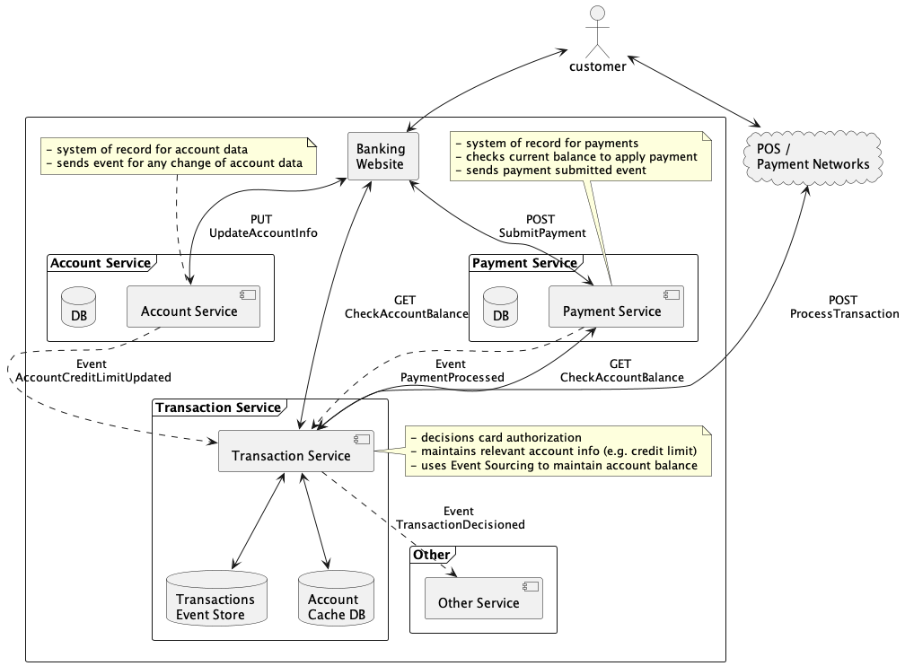

# Transactions Processing Service

## Capabilities:

This is an example of credit card processing Event Driven system. Main focus is places on Event Sourcing patterns.

### Payments services
- not implemented
- assumptions
  - responsible for receiving payments
  - if payments is low risk announce the payment
  - there is chance payment may bounce, announce returned payment

### Account services
- not implemented
- assumptions
  - booking new accounts
  - maintaining changes to accounts (e.g. credit limit, personal information etc.)
  - change to account state is published as change event

### Transaction processing platform
- external system requests decisioning on credit card transaction via API call
- listens to payments platform and applies payment events
- listens to account change to maintain local state of accounts
  - reason to maintain local state is to avoid expensive calls to Account service

## System Design Diagram



## Usage

Submit transaction for processing

```
curl -XPOST -H "Content-Type: application/json" http://localhost:8080/process-transaction -d \
'{"account": 123, "card": 123456789, "amount": 2099, "merchantCode": "WLMRT", "zip": "80126", "countryCode": 0}'
```

Transaction Payload

```json
{"payload": {"cardNumber": 12345678, "amount": 4000, "merchantCode": "ABC", "zipOrPostal": "80126", "countryCode": 1}, "eventId": "123", "eventName": "preDecisionedTransactionRequest", "eventTimestamp": 100}
```

Payment Approved Payload

```json
{"payload": {"accountId": 123, "paymentId": "123", "amount": 200, "recordedTimestamp": 1658108329}, "eventId": "123", "eventName": "paymentSubmitted", "eventTimestamp": 1658108328}
```

Payment Returned Payload

```json
{"payload": {"accountId": 123, "paymentId": "123", "amount": 200, "recordedTimestamp": 1658108329}, "eventId": "123", "eventName": "paymentReturned", "eventTimestamp": 1658108328}
```

## TODO
- how to recover application state to point in time