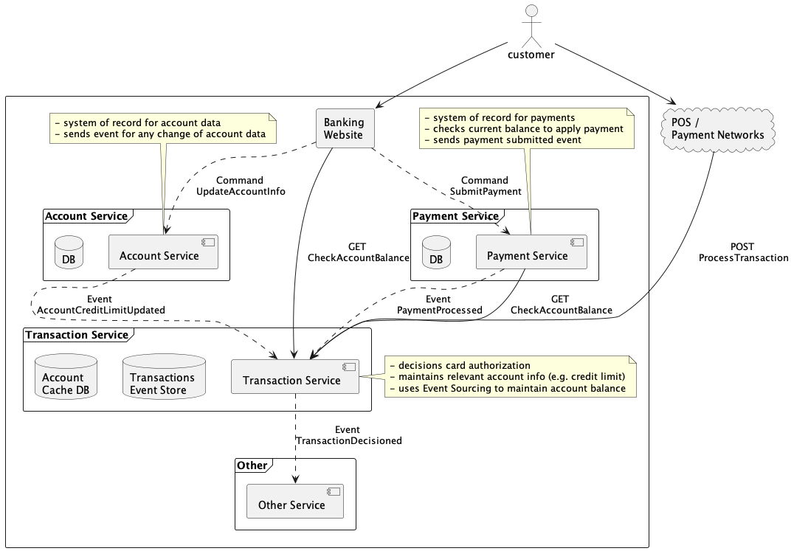

# Transactions Processing Service

Purpose of this project is exploration of various event driven techniques such as Event Choreography, Event Carried State Transfer and Event Sourcing.
This project exemplifies simplified card transaction processing system. [Read more about these techniques here](docs/event_driven.md).

**Note: this is a POC, this code should not be used as example of production implementation**

Requirements driving design decisions are:

- system should be designed to handle high volume of requests thus synchronous network calls between internal subsystems should be limited to minimum 
- transactions need to be stored in a way that would allow auditing

# Capabilities:

## Payments service
- responsible for managing payments
  - normally payment service would perform some rules to verify payment, see below.
    - if payment is low risk, store and publish payment-submitted event
    - if payment ends up bouncing, store and publish payment-returned event

## Account services
- booking new accounts
- maintaining changes to accounts (e.g. credit limit change, personal information etc.)
- change to credit limit will result in publishing state change event

## Transaction processing platform
- implemented as event sourced system
  - purchase and payment transactions are stored as events and used to reconstruct account state
- exposes API endpoint for external service to request process transaction
- exposes API endpoint for external service to request current state of account balance
- exposes API endpoint for external service to fetch recent transactions
- listens to payments platform and applies payment events (payments submitted and returned)
- listens to account change events to maintain local state of accounts (account credit limit update)
  - reason to maintain local state is to avoid expensive calls to Account service on each purchase request
- after transaction was decisioned, event is published with decision results; same information is used in response to API call

## Not in scope / other considerations
- snapshots for transaction events, it is common to snapshot events in EventStore to improve performance when rebuilding states from events
- ability to rebuild state of local account information stored in Transactions service
- ensure processing events is idempotent - prevent processing event twice

## System Design Diagram

## Start All Services Without Containers (preferred)

This will start only containerized Kafka cluster and Zipkin.

Ensure Java 8 is the default JVM

`./setup.sh`

`docker-compose -f zk-single-kafka-single.yml up` (terminal 1)

`./start_all.sh` (terminal 2)

## Start All Services Using Containers

This should start all applications and kafka cluster. Once logs stop printing it means all services are connected. Web UI will be availabe at `localhost:9000`.

Build all containers with included `build.sh` in each subproject.

Modify `zk-single-kafka-single.yml` and change host to `EXTERNAL_SAME_HOST://host.docker.internal:19092`

`docker-compose -f zk-single-kafka-single.yml -f all-apps.yml up`

`docker-compose -f zk-single-kafka-single.yml -f all-apps.yml down`

## Kafka Related

https://www.oreilly.com/library/view/kafka-the-definitive/9781491936153/ch04.html

https://kafka.apache.org/quickstart

https://github.com/conduktor/kafka-stack-docker-compose

